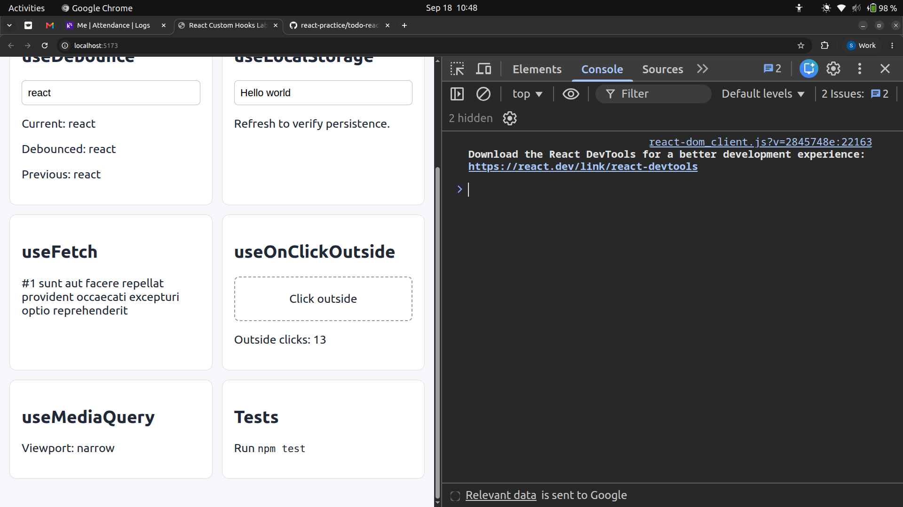

# React Custom Hooks Lab

A TypeScript-based React project demonstrating the implementation, testing, and practical usage of six reusable custom hooks. The project includes an interactive demo page so each hook can be tested directly in the browser.

## Project Approach

The project was designed around **reusability, separation of concerns, TypeScript type safety, and testability**. Each hook is implemented independently inside the `hooks` directory, while a dedicated test file validates its behavior and edge cases.

```text
src/
├── hooks/
│   ├── useDebounce.ts
│   ├── useLocalStorage.ts
│   ├── useFetch.ts
│   ├── usePrevious.ts
│   ├── useOnClickOutside.ts
│   └── useMediaQuery.ts
├── test/
│   └── *.test.ts
├── App.tsx
└── main.tsx
```

## Hooks Implemented

### 1. `useDebounce(value, delay)`

Delays updating a value until it remains unchanged for the specified delay.

**Approach:** Uses `setTimeout` inside `useEffect` and clears the previous timer whenever the value or delay changes.

**Use case:** Search inputs, autocomplete, and reducing unnecessary API calls.

### 2. `useLocalStorage(key, initialValue)`

Creates state that automatically persists to browser `localStorage`.

**Approach:** Initializes state from `localStorage`, serializes updates with `JSON.stringify`, and handles invalid stored data safely.

**Use case:** User preferences, settings, and persistent client-side state.

### 3. `useFetch(url)`

Provides reusable API request handling with:

* `loading`
* `data`
* `error`
* HTTP error handling
* request cancellation

**Approach:** Uses `fetch()` with `async/await` and `AbortController`. The request is cancelled during cleanup or when the URL changes.

### 4. `usePrevious(value)`

Returns the value from the previous render.

**Approach:** Uses `useRef` to store the previous value and updates the ref inside `useEffect`.

### 5. `useOnClickOutside(ref, handler)`

Detects clicks outside a referenced element.

**Approach:** Registers document-level mouse/touch listeners and checks whether the event target is contained inside the referenced element. Listeners are removed during cleanup.

**Use case:** Modals, dropdowns, menus, and popovers.

### 6. `useMediaQuery(query)`

Tracks whether a CSS media query currently matches.

**Approach:** Uses `window.matchMedia()` and subscribes to its `change` event so React state updates when the viewport changes.

## Unit Testing

Each hook has dedicated unit tests using **Vitest** and **React Testing Library**.

Tests cover both normal behavior and important edge cases:

* Debounce timing and timer cleanup
* LocalStorage persistence and invalid JSON
* Fetch success, HTTP errors, network errors, and cancellation
* Previous render values
* Inside vs. outside clicks
* Media-query changes

Run all tests with:

```bash
npm test
```

## Demo Page

An interactive demo page was created to demonstrate all six hooks in a browser.

The demo allows users to:

* Change a value and observe debouncing
* Update a value persisted in localStorage
* Trigger and observe a fetch request
* Compare current and previous values
* Test outside-click detection
* Resize the browser to test media-query updates

Run the demo with:

```bash
npm run dev
```

## Tech Stack

* React
* TypeScript
* Vite
* Vitest
* React Testing Library
* Browser APIs: `localStorage`, `fetch`, `AbortController`, `matchMedia`

## Key Design Principles

* **Reusable:** Each hook solves one specific problem.
* **Type-safe:** Generic and explicit TypeScript types are used where appropriate.
* **Cleanups:** Timers, event listeners, and network requests are properly cleaned up.
* **Testable:** Hook behavior is isolated and independently unit-tested.
* **Practical:** A demo page shows how each hook can be used in real React components.

## Setup

```bash
npm install
```

Run tests:

```bash
npm test
```

Start the development server:

```bash
npm run dev
```

Build for production:

```bash
npm run build
```
## Output



