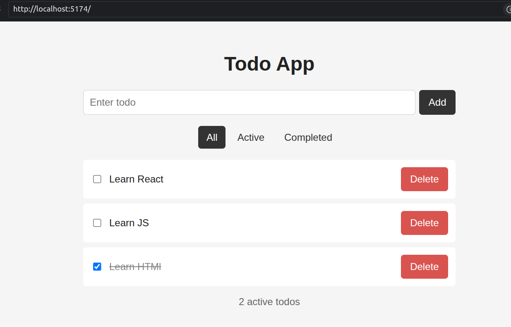
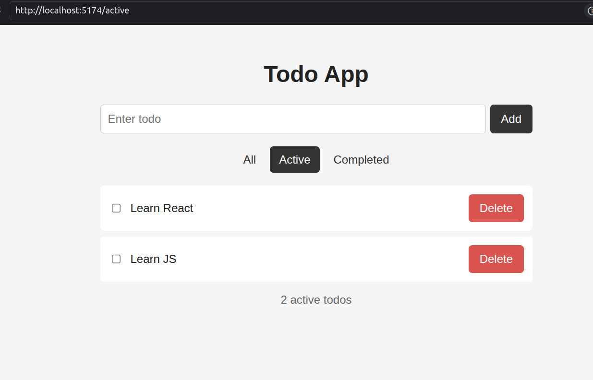
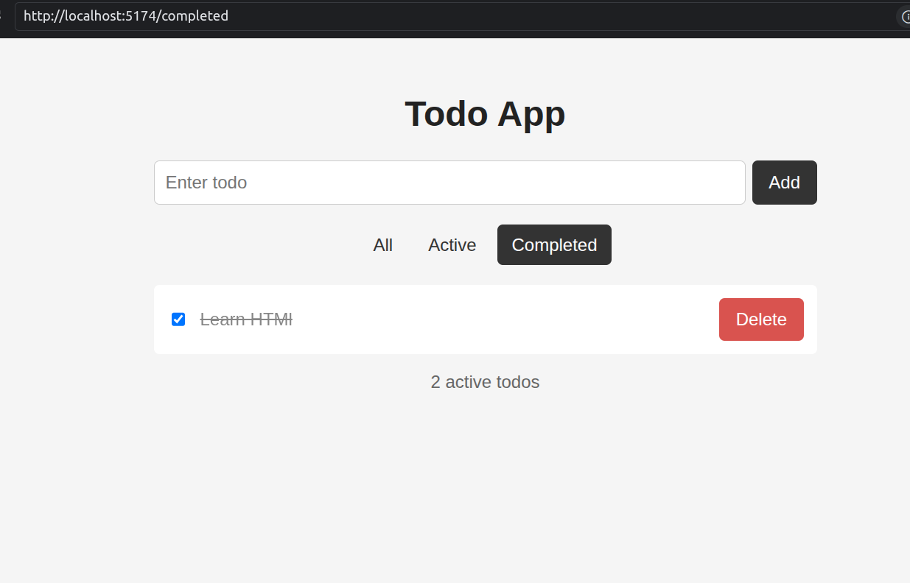

# Todo App - React + TypeScript

A simple and responsive Todo application built by migrating a JavaScript Todo app to **React + TypeScript**.

### Features

* Add, complete, and delete todos
* Filter todos by **All / Active / Completed**
* Persistent data using `localStorage`
* Custom `useLocalStorage` hook
* React Router filter tabs
* Fully typed with TypeScript
* Immutable state updates and reusable components

### Tech Stack

**React • TypeScript • React Router • Vite • CSS • LocalStorage**

### Routes

* `/` — All Todos
* `/active` — Active Todos
* `/completed` — Completed Todos

### Run Locally

```bash
npm install
npm run dev
```

### Screenshots

#### All Todos



#### Active Todos



#### Completed Todos

